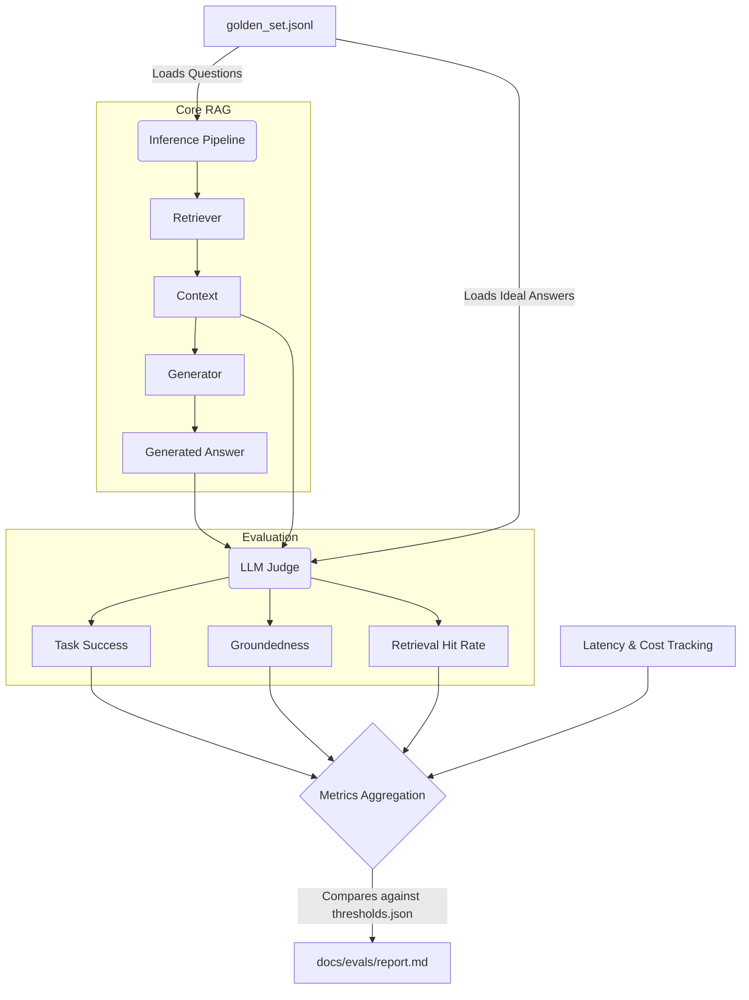

# RAG Evaluation Pipeline Architecture

## What is the Evaluation Pipeline?

The Evaluation Pipeline is a critical automated testing component of the RAG (Retrieval-Augmented Generation) system. It measures the accuracy, relevance, and performance of the RAG pipeline by running a standardized set of test questions (a "Golden Set") through the system and comparing the generated answers against ground-truth expected answers.

Instead of relying on human manual testing, it uses an **"LLM-as-a-Judge"** approach. A designated evaluator language model (such as GPT-4o-mini, HuggingFace, or Ollama) assesses the quality of the system's output based on strict rubrics. It evaluates logical metrics like Task Success Rate, Groundedness (hallucination prevention), and Retrieval Hit Rate, while the system concurrently tracks operational metrics like token Cost and p50/p95 Latency.

---

## How it Works: Flow Diagram

The evaluation process follows a structured sequence:

1. **Load Data**: The orchestrator loads the `golden_set.jsonl` (questions and ideal answers) and the evaluation `thresholds.json`.
2. **Execute Pipeline**: For each question, it runs the standard Inference Pipeline (Embedding -> Retrieval -> Generation).
3. **Judge Execution**: The retrieved context and generated answer are passed to the `LLMJudge`, which scores them against the expected ideal answer.
4. **Aggregate & Report**: Metrics, latencies, and costs are aggregated across all questions, compared against the predefined thresholds, and written to a Markdown report.

---

## Metrics Calculated

The pipeline calculates a mix of qualitative (LLM-judged) and quantitative (system-measured) metrics:

### 1. Task Success (Answer Relevance/Resolution)
- **What it is**: Compares the System's Final Response to the User's Original Query. It evaluates whether the generated output actually answers the question or follows the instructions requested by the user, regardless of how the system got the information.
- **Scoring**: A continuous float score from 0.0 to 1.0 (e.g., 1.0 for completely correct even if phrased differently).

### 2. Groundedness (Faithfulness)
- **What it is**: Compares the System's Final Response to the Retrieved Context. It evaluates whether the facts stated in the final answer are strictly supported by the retrieved documents, ensuring the LLM didn't hallucinate or rely on its pre-trained outside knowledge.
- **Scoring**: A continuous float score from 0.0 to 1.0 (e.g., 1.0 if fully supported semantically).
- **Relation to Precision**: High Groundedness acts as a proxy for high **Precision** in generation—ensuring that whatever is generated is actually accurate and rooted in the provided context.

### 3. Retrieval Hit (Context Relevance)
- **What it is**: Compares the Retrieved Context to the User's Original Query (or a known Ideal Answer). It evaluates whether the vector database search successfully surfaced the exact documents containing the necessary information to solve the user's prompt, before the LLM even attempts to generate a response.
- **Scoring**: A continuous float score from 0.0 to 1.0 (e.g., 1.0 if all necessary facts are present).
- **Relation to Recall**: This is a direct measure of **Recall** in the retrieval stage. A high Retrieval Hit Rate means the retriever successfully "recalled" the necessary facts from the vector database to answer the user's question.

### 4. Operational Metrics
- **Cost / Query**: The estimated dollar cost of running a single query, calculated by counting tokens sent to the Embedding Model and LLM Generator, multiplied by the token rates defined in your `.env` file.
- **Latency (p50 & p95)**: The total round-trip time. `p50` represents the median user experience, while `p95` represents the "worst-case" scenario, ensuring 95% of queries complete within that time limit.

---

## Troubleshooting & Tuning Configurations

When a specific metric drops below your thresholds, you can adjust the pipeline configurations in your `.env` or `config/settings.py` files to resolve the issue:

### If Retrieval Hit Rate (Recall) is low:
*The system isn't finding the right documents.*
- **Increase `TOP_K`**: Retrieve more documents to increase the surface area of potential hits.
- **Adjust Chunking**: If chunks are too small, context is lost. If they are too large, the embeddings get diluted. Adjust `CHUNK_SIZE` and `CHUNK_OVERLAP`.
- **Change Embedding Model**: Switch `OPENAI_API_EMBEDDING_MODEL` to a more capable model (e.g., from `text-embedding-3-small` to `text-embedding-3-large`).
- **Enable `USE_HYBRID_SEARCH`**: Combines dense semantic search with sparse keyword search (e.g., BM25/SPLADE). **When to use**: Turn this on if the documents contain domain-specific terminology, acronyms, or exact IDs where semantic models struggle but exact keyword matching excels.
- **Enable `USE_MULTI_QUERY` or `USE_QUERY_DECOMPOSITION`**: Uses an LLM to generate variations or sub-components of the user's original query, casting a wider semantic net. **When to use**: Turn these on if users ask vague, multi-part, or highly complex questions that a single vector representation can't accurately capture.
- **Use a Reranker**: Implement a cross-encoder to re-rank the `TOP_K` results for better relevancy.

### If Groundedness is low (Precision is suffering):
*The model is hallucinating or ignoring the context.*
- **Adjust Generator Prompt**: Make the prompt stricter in `src/rag/prompts/prompts.py` (e.g., "Answer ONLY using the context. If you don't know, say 'I don't know'.").
- **Change Generator LLM**: Switch `LLM_SOURCE` or `OPENAI_LLM_MODEL` to a smarter model (e.g., `gpt-4o`) that follows instructions better.

### If Task Success Rate is low (but Retrieval is high):
*The right info was retrieved, but the model gave a bad answer.*
- **Lower LLM Temperature**: Ensure the model generation isn't too creative by setting temperature closer to `0.0`.
- **Change Generator LLM**: Switch to a more capable reasoning model.
- **Prompt Engineering**: The generator might need step-by-step instructions (Chain of Thought) to synthesize complex context into the final answer.

### If Latency or Cost is too high:
- **Switch to a smaller model**: Change `OPENAI_LLM_MODEL` to `gpt-4o-mini` or use `OLLAMA_LLM_MODEL` (local inference costs $0).
- **Disable Advanced Retrievers**: If `USE_MULTI_QUERY` or `USE_QUERY_DECOMPOSITION` are enabled, they invoke the LLM to rewrite queries *before* retrieval. This significantly increases both latency (extra LLM calls) and cost. Turn these off if speed is the priority.
- **Disable `USE_HYBRID_SEARCH`**: Generating a second sparse embedding and performing dual-retrieval/fusion adds a slight latency overhead (though it rarely affects LLM costs).
- **Decrease `TOP_K`**: Retrieving and passing fewer chunks reduces the input token count significantly, which lowers both latency and cost.

---

## Related File Information

The evaluation pipeline is modular and relies on the following configuration and logic files:

- **`bin/run_evals.sh`**: The executable shell script that sets up the Python virtual environment, installs dependencies, and triggers the Python orchestrator.
- **`scripts/run_rag_eval.py`**: The main orchestrator script. It wires together the dataset, the inference pipeline, the judge, and the report generator.
- **`src/eval/golden.py`**: Contains the core evaluation loop. It measures total and generation latency, calculates token costs, invokes the RAG pipeline, and asks the judge for scores. It also aggregates the final results and percentiles (p50, p95).
- **`src/eval/judge.py`**: The LLM Judge logic. It queries the configured judge model (OpenAI, HuggingFace, or Ollama) using the evaluation rubrics, extracting the JSON `score` field.
- **`src/rag/prompts/prompts.py`**: Centralized storage for the evaluation prompts used by the judge to enforce strict grading rules.
- **`config/settings.py`**: Stores environment configurations (`JUDGE_SOURCE`, `OPENAI_JUDGE_MODEL`, cost per token settings) loaded from the `.env` file.
- **`data/golden_set.jsonl`**: The dataset of test questions and expected ideal answers used as the ground truth.
- **`data/evals/thresholds.json`**: Defines the target KPIs (e.g., "Acceptable" vs "Good") for task success, retrieval hit rate, latency, and costs.

---

## Generated File Information

- **`docs/evals/report.md`**: The final artifact produced automatically by the pipeline. It contains a tabular breakdown of all aggregated metrics (Task Success Rate, Groundedness, Retrieval Hit Rate, Cost per Query, and Latency) and evaluates whether they meet the predefined thresholds (Acceptable/Good/Poor).
- **`data/evals/all_results.json`**: A single JSON file containing all questions from the golden set, along with the ideal answer, generated answer, latency, cost, and evaluated metrics (Task Success, Groundedness, Retrieval Hit Rate) for each question.
