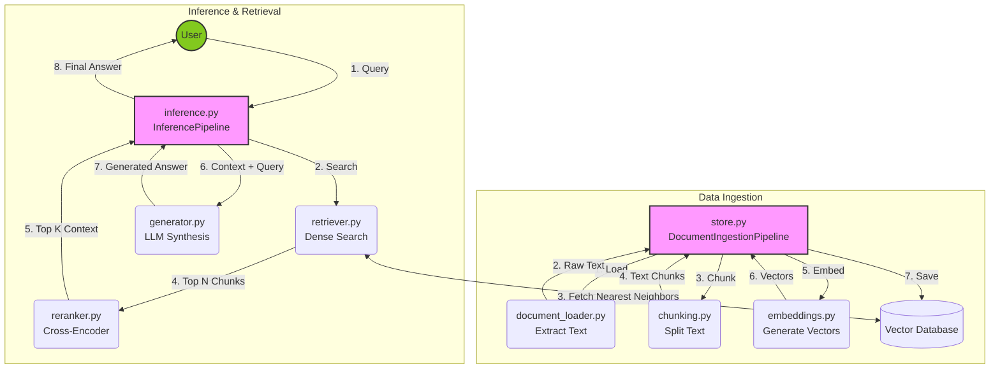

# Capstone: RAG Pipeline

This repository contains the production-ready structure for an end-to-end Retrieval Augmented Generation (RAG) system. Every single file in this project serves a dedicated, decoupled role to ensure scalability and maintainability.

## 🗺️ Architecture Overview

The system operates via two primary orchestration pipelines that cleanly decouple data processing from querying:

1. **Data Ingestion Pipeline** (`store.py`): Extracts text from raw documents, chunks them into manageable pieces, generates dense vector embeddings, and stores them in a Vector Database.
2. **Inference Pipeline** (`inference.py`): Receives user queries, retrieves the most relevant context from the Vector Database, optionally reranks the results for higher accuracy, and generates an LLM-powered answer.

Below is a **Comprehensive Deep Dive** into every directory and file in this repository.

---

## 🏗️ 1. Core RAG Engine (`src/rag/`)
This is the heart of the system where raw documents are transformed into AI-ready vectors and queried.

- **`document_loader.py`**: Reads raw files from the disk and extracts their text content cleanly. Uses a Factory Design Pattern and asynchronous I/O (`run_in_executor`) so large files don't block the main web server. Currently implements `TextLoader` and `MarkdownLoader` with planned support for PDFs and Word docs.
- **`chunking.py`**: Breaks down large, continuous documents into smaller, semantically meaningful text pieces. Implements **Sliding Window Chunking** which uses string slicing to split text by fixed lengths while maintaining a slight overlap to preserve context across boundaries.
- **`embeddings.py`**: An abstraction layer for converting text chunks into dense vector representations. Wraps both cloud APIs (`OpenAIEmbeddings`) and local, private models (`OllamaEmbeddings`). Uses a `ModelSelector` to efficiently batch process text.
- **`vector_store.py`**: The interface for interacting with vector databases (like ChromaDB or Pinecone). It handles inserting document chunks and embeddings, and executing similarity searches.
- **`retriever.py`**: Takes a user's query, embeds it, and fetches the most relevant chunks from the `vector_store.py`. Built to support dense vector search, sparse keyword search (BM25), and hybrid approaches.
- **`reranker.py`**: A secondary retrieval stage to improve accuracy. Implements a `RerankerFactory` that dynamically selects between local rerankers (`CrossEncoderReranker` via `sentence-transformers`) and cloud APIs (`CohereReranker`).
- **`generator.py`**: Bridges the gap between retrieved documents and the final user answer. It injects the context from `retriever.py` into prompt templates and makes the final LLM API call to generate the answer.
- **`prompts/`**: A directory intended to hold `.txt` files containing the raw system and user prompt instructions for the LLM.

## ⚙️ 2. Data Persistence & Orchestration (`src/pipeline/`)
This module acts as the "Conductor" tying the independent RAG modules together into sequential workflows.

- **`store.py`**: Contains the `DocumentIngestionPipeline`. This is the orchestrator for ingesting data. By using Dependency Injection, it accepts a chunker and embedder, then runs a strict pipeline: **Load -> Chunk -> Embed -> Store**. It includes recursive directory walking, robust `try/except` error handling, and comprehensive logging.
- **`inference.py`**: The orchestrator for the "Query" side of the pipeline (taking a user question and returning an answer). It successfully ties together the `retriever`, `reranker`, and `generator` to output a final synthesized response.

## 🧪 3. Evaluation System (`src/eval/`)
RAG systems must be quantitatively tested. This directory holds scripts to grade the AI's answers.

- **`judge.py`**: Implements an "LLM-as-a-judge" paradigm where a superior model (like GPT-4) is prompted to grade the RAG pipeline's generated answers on relevance, accuracy, and hallucination.
- **`golden.py`**: Utilities for testing the pipeline against a "golden dataset" (a curated list of known questions and exact expected answers) to track accuracy over time.
- **`pairwise.py`**: A/B testing logic used to compare two different versions of the RAG pipeline (e.g., comparing OpenAI embeddings vs Ollama embeddings) side-by-side.
- **`critic_creator.py`**: Experimental, autonomous agents designed specifically to try and break or find flaws in the generated text.

## 🧱 4. Data Models & Schemas (`src/schemas/`)
To ensure type safety and predictability, all data passed between functions must follow strict structures.

- **`api.py`**: Defines the Pydantic models for the FastAPI backend (e.g., the structure of an incoming `QueryRequest` and outgoing `QueryResponse`).
- **`rag.py`**: Defines the internal Python classes and structures used by the RAG engine (e.g., standardizing what a `DocumentChunk` or a `RetrievalResult` object looks like).

## 🌐 5. Backend API (`api/`)
- **`main.py`**: The FastAPI application. It imports the pipelines from `src/pipeline/` and exposes them as RESTful web endpoints (like `/upload` and `/query`). This acts as the backend server.

## 🖥️ 6. Frontend User Interface (`ui/`)
- **`app.py`**: The Streamlit application that acts as the user-facing frontend. It provides a chat interface, allows users to upload documents, and features configuration sidebars.
- **`components/`**: A directory for reusable Streamlit UI widgets and components (e.g., custom chat bubbles or loading spinners).

## 🔧 7. Configuration & Environment (`config/`)
- **`settings.py`**: Centralized configuration management. It uses `pydantic-settings` to load, type-check, and parse environment variables from your `.env` file (like API keys, DB paths, and the `DATA_DIRECTORY`).
- **`logging_config.py`**: A standardized Python logging setup (`setup_logger`). It ensures all logs across the entire application share the same consistent formatting and are piped correctly.

## 🛠️ 8. Execution Wrappers (`bin/`)
Convenient shell and PowerShell scripts that automatically handle virtual environment creation (`uv venv`), dependency installation (`uv pip install`), and `PYTHONPATH` exports before executing the Python pipelines.
- **`run_ingestion.sh` / `run_ingestion.ps1`**: Executes the `store.py` ingestion pipeline.
- **`run_inference.sh` / `run_inference.ps1`**: Executes the `inference.py` pipeline for interactive CLI querying.

## 🚀 9. Execution Scripts (`scripts/`)
Command-line Python scripts used for running batch tasks without booting up the web server.
- **`run_eval.py`**: Executes a standard evaluation run on a dataset.
- **`run_rag_eval.py`**: Orchestrates an end-to-end pipeline evaluation.
- **`run_pairwise.py`**: Triggers a head-to-head A/B comparison.
- **`run_critic_creator.py`**: Runs the experimental critic agents.

## 🚥 10. Unit Testing (`tests/`)
Contains `pytest` stubs and test suites isolating specific components to ensure code stability during refactoring.
- **`test_rag.py`**: Validates the core logic in chunking, embedding, and retrieval.
- **`test_judge.py`, `test_golden_loader.py`, `test_pairwise.py`**: Validates the evaluation algorithms.
- **`test_api.py`, `test_ui.py`**: Asserts correctness for FastAPI endpoints and Streamlit rendering logic.

---

## 💾 Data & Auxiliary Directories
- **`data/`**: Local storage for `uploads/`, raw knowledge base documents (`raw_markdown/`), SQLite and Vector DBs (`db/`), and benchmark files (`golden_set.jsonl`).
- **`notebooks/`**: Jupyter notebooks (`.ipynb`) for exploratory data analysis and prototyping.
- **`.env` / `.env.example`**: Environment variables (secrets, API keys, and configurations).
