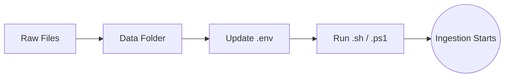
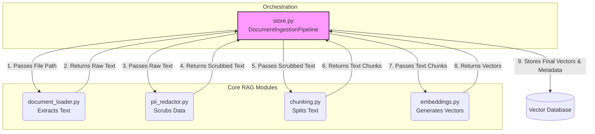
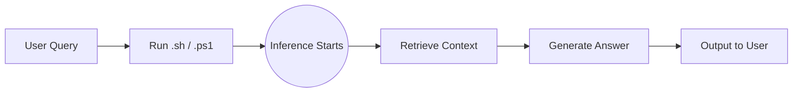
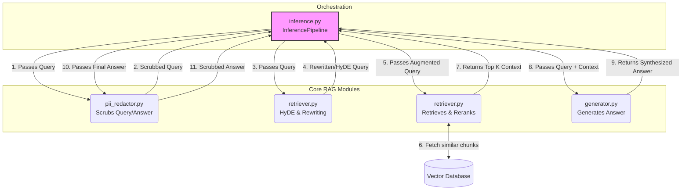

# Pipeline Architecture

This document outlines the end-to-end architecture of the Document Ingestion and Inference Pipelines. It details the high-level user workflow and the underlying Python orchestration that processes raw files into AI-ready vectors and subsequently uses them to generate accurate answers.

## 🔄 1. The High-Level User Workflow

The system is designed to be easily configurable without altering the underlying code. The ingestion process follows this simple user flow:

1. **Files**: You collect your raw knowledge-base documents (e.g., `.md`, `.txt`).
2. **Specific Folder**: You place all these files into a specific directory on your machine (e.g., `data/test/`).
3. **Update `.env`**: You update the `DATA_DIRECTORY` variable in your `.env` file to point to that specific folder.
4. **Execution**: You run the ingestion script using either `bin/run_ingestion.sh` (Mac/Linux) or `bin/run_ingestion.ps1` (Windows).

---

## 🧠 2. The Orchestration Layer (`store.py`)

When you execute the shell scripts, they trigger the `src/pipeline/store.py` module. 

`store.py` contains the `DocumentIngestionPipeline`. This class acts as the central **Orchestrator** (or conductor) for the entire ingestion process. Rather than doing the heavy lifting itself, it delegates tasks to specialized modules sequentially.

It coordinates the flow of data through three primary RAG modules:

1. **Document Loader** (`document_loader.py`): Extracts raw text from files.
2. **PII Redactor** (`pii_redactor.py`): (Optional) Scrubs sensitive data using Microsoft Presidio.
3. **Chunking** (`chunking.py`): Splits the raw text into manageable pieces.
4. **Embedding** (`embeddings.py`): Converts those pieces into mathematical vectors (both Dense and Sparse vectors, if Hybrid is enabled).

---

## 🏗️ 3. Detailed Architecture Diagram

The flowchart below demonstrates exactly how `store.py` coordinates data between the specialized modules during the ingestion of a single file:

### Deep Dive into the Modules:
* **`document_loader.py`**: Utilizes a Factory Pattern to determine if a file is a `.txt` or `.md` file, and uses asynchronous threads to read the file from the disk without blocking the system.
* **`pii_redactor.py`**: Intercepts the raw text and utilizes a hybrid NLP (spaCy/transformers) and rules-based regex engine (Microsoft Presidio) to automatically scrub out PII like Names, SSNs, and Financial information before it ever hits the chunker.
* **`chunking.py`**: Implements a Sliding Window technique. It takes the massive string of scrubbed text returned by the redactor and cuts it into chunks of exactly 1200 characters, leaving a 200-character overlap between chunks so that context isn't lost at the boundaries.
* **`embeddings.py`**: Takes the array of text chunks and passes them to configured Machine Learning models (like OpenAI or Ollama for dense embeddings, and `fastembed` SPLADE/BM25 for sparse embeddings). The model translates the semantic meaning of the text into dense arrays of floating-point numbers (vectors) and keyword weights (sparse vectors), which are ultimately what the vector database uses to perform similarity searches.

---

## 🔍 4. The Inference Pipeline (`inference.py`)

Once data has been ingested, the Inference Pipeline takes over to answer user questions using the stored knowledge. Similar to ingestion, it can be triggered via the CLI scripts `bin/run_inference.sh` (or `.ps1`).

`inference.py` contains the `InferencePipeline` which coordinates the querying process by delegating to specialized modules.

### Deep Dive into the Inference Modules:
* **`pii_redactor.py`**: Intercepts the user's query initially to scrub any sensitive data before it gets embedded, ensuring no PII reaches the database. It also scrubs the final generated answer for maximum safety.
* **Query Augmentation (in `retriever.py`)**: Before searching the vector database, the query can be augmented. **HyDE** (Hypothetical Document Embeddings) uses an LLM to generate a hypothetical answer and uses *that* answer to search the database. **Query Rewriting** reformulates vague queries into highly optimized search strings.
* **`retriever.py`**: Embeds the augmented query (dense and optionally sparse vectors) and performs a similarity search against the vector database to find the most relevant document chunks. For hybrid search, it handles Reciprocal Rank Fusion (RRF) natively or via manual fallback depending on the underlying vector store. It optionally utilizes `reranker.py` to refine the results.
* **`reranker.py`**: (Optional) Acts as a secondary retrieval stage. It takes the initial results from the retriever and scores them using a Cross-Encoder model to ensure only the highest-quality context is returned.
* **`generator.py`**: Takes the highly relevant context chunks and the user's original query, injects them into an LLM prompt template, and calls the LLM to synthesize a conversational and accurate answer.
